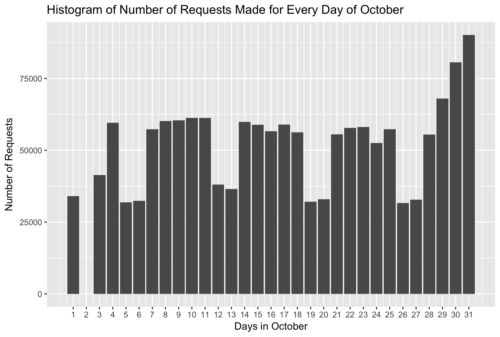

# NASA_Server_Log_Analysis
Used Hadoop/MapReduce and Hive to analyze, explore, and answer questions about Nasa's server log files.

Find the number of 200 status code in the response in the month of August.
Answer : 2797976

Find the number of unique source IPs that have made requests to the NASA server for the month of September.
Answer : 81982

Which was the most requested URL in the year 1995.
Answer: /images/NASA-logosmall.gif

Simple plot depicting the number of requests made in a day for every day in the month of October.

